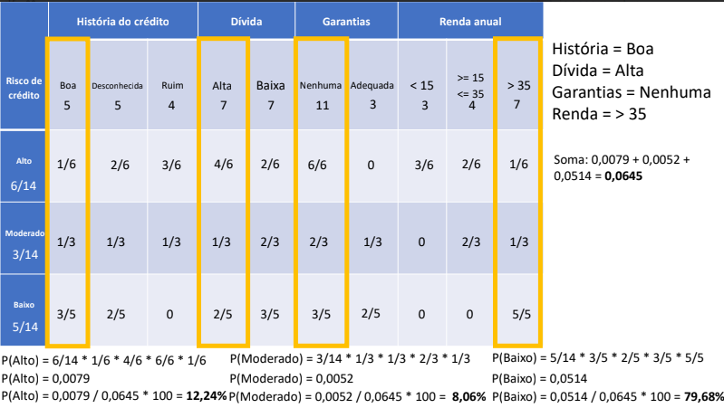

# Algoritmo Naïve Bayes  

- Abordagem probabilística (Teorema de Bayes)
- Exemplos (Classificação de Textos):  
    - Filtros de spam
    - Mineração de emoções  
    - Separação de documentos  
  
---

A montagem da tabela de *Naïve Bayes* consiste em pegar as interseções com base nas classes e descritores. Fixe uma classe:
> História de Crétido  
> 5 Boa / 5 Desconhecida / Ruim  

Agora conte em cada uma quantos registros encaixam em:  
> Alto (6/14) / Moderado (3/14) / Baixo (5/14)  

Faz-se então uma interseção dos dois em um tabela de probabilidade. Nesse caso, como temos categorias na classe e 3 Riscos formamos uma matriz $3\times3$.

# Classificação  
  
Literalmente consiste em multiplicar a probabilidade dos eventos.  
Nesse caso o cliente teve 79,68% de chance de ser classficado como risco baixo. 
# Correção Laplaciana  
Quando houver valores nulos adiciona mais um registro para não zerar as probabilidades.  
# Mais conceitos  
- Probabilidades *a priori*  
- Probabilidades *a posteriori*     

**Vantagens**:  
- Rápido, Simplicidade de interpretação, Trabalha com altas dimensões, boas previsões em bases pequenas.  

**Desvantagens**  
- Combinação de características (atributos independentes) - cada par de características são independentes - *nem sempre é verdade*.

