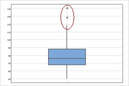
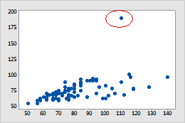

# Outliers

## Introdução
-  Valores anormais
-  Valores fora do padrão (afastados da média)  
  
> Detecção de Outliers  
> Apenas uma variável: __boxplot__  

  

> Duas variáveis: __gráfico de dispersão__ (*scatter plot*)  
> 

- __Causas__  
  - acaso
  - erro no preenchimento dos dados
  - __Fraudes__  

- __Tratamento__    
  - Remover o registro
  - Não fazer nada
  - Substituir o valor